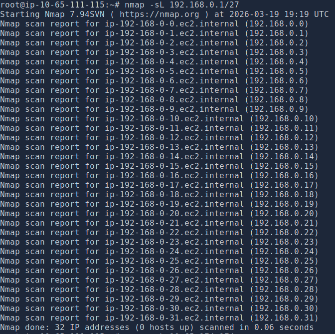
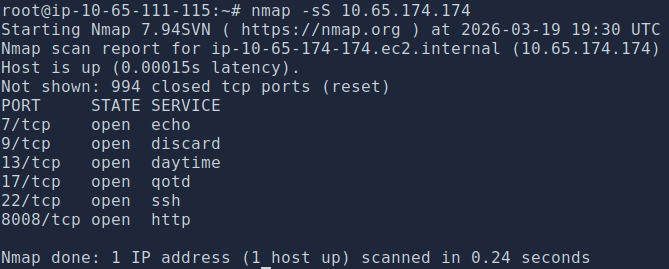
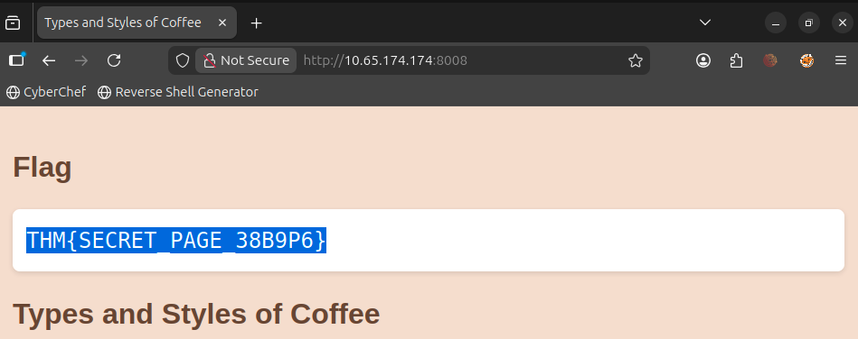
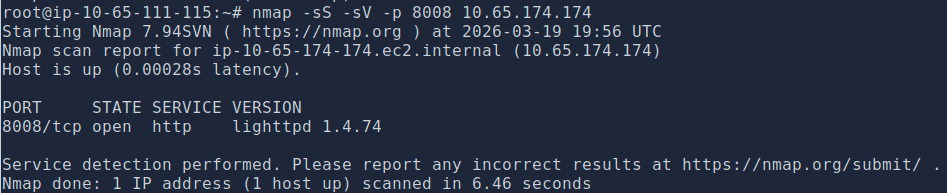

```
┌──(abhi㉿security)-[~/certifications/tryhackme-cyber-security-101/networking]
└─$ cat nmap-basics.md
```

# Nmap: The Basics

**Path:** TryHackMe — Cyber Security 101  
**Module:** Networking  
**Room:** Nmap: The Basics  
**Date Completed:** March 19, 2026

[]()
[]()
[]()

---

## What Is Nmap

Nmap (Network Mapper) is one of the most widely used tools in security for network scanning. The core idea is simple — you point it at a target and it tells you what's alive, what ports are open, and what services are running on those ports. As a SOC analyst understanding what's on your network is foundational, and Nmap is one of the first tools that makes that possible.

---

## What I Actually Did

### Lab 1 — List Scan: Finding Hosts on a Subnet

The first lab had me run a list scan against a `/27` subnet to enumerate all IP addresses in that range without actually sending packets to the hosts.

**Command I ran:**
```bash
nmap -sL 192.168.0.1/27
```



The `/27` subnet gives you 32 addresses — `192.168.0.0` through `192.168.0.31`. The task was to identify the last IP in that range. No packets were actually sent to these hosts, it just resolved and listed them. Good first step to understand a target network's scope before doing anything noisier.

---

### Lab 2 — SYN Scan: Finding Open Ports and Capturing a Flag

Next was port scanning. The lab had me run a SYN scan against a specific target to find open ports, then use what I found to grab a flag from an HTTP service.

**Command I ran:**
```bash
nmap -sS 10.65.174.174
```



The scan came back with 6 open ports — echo (7), discard (9), daytime (13), qotd (17), SSH (22), and HTTP on port 8008. Most of those are legacy services you'd rarely see in a modern environment — which itself is a finding worth noting. The interesting one was port 8008 running HTTP. Navigated to `http://10.65.174.174:8008` in the browser and found the flag sitting on the page.



**Flag captured:** `THM{SECRET_PAGE_38B9P6}`

The SYN scan (`-sS`) is sometimes called a "half-open" scan — it sends a SYN, gets a SYN-ACK back if the port is open, then sends a RST to close the connection before it fully establishes. Faster and quieter than a full connect scan, which is why it's the default when running with sudo.

---

### Lab 3 — Service and Version Detection

The third lab introduced detection flags. The goal was to identify the exact name and version of the web server running on port 8008.

**Command I ran:**
```bash
nmap -sS -sV -p 8008 10.65.174.174
```



With `-sV` added, Nmap identified the service as `lighttpd 1.4.74` — not just "http" but the actual web server software and its exact version. That version information is significant because you can cross-reference it against CVE databases to find known vulnerabilities. That's where scanning stops being recon and starts becoming something actionable.

**Key detection flags:**

| Flag | What It Does |
|---|---|
| `-sV` | Service and version detection |
| `-O` | OS detection |
| `-A` | Aggressive — runs OS detection, version detection, scripts, and traceroute |
| `-Pn` | Treat all hosts as online — scan even hosts that appear to be down |

---

### Lab 4 — Timing, Performance, and Verbosity

The final section covered how to control scan speed and output detail.

**Timing templates:**

| Template | Name | Use Case |
|---|---|---|
| `-T0` | Paranoid | Maximum IDS evasion — extremely slow |
| `-T1` | Sneaky | IDS evasion |
| `-T2` | Polite | Reduce bandwidth impact |
| `-T3` | Normal | Default |
| `-T4` | Aggressive | Fast networks, CTFs |
| `-T5` | Insane | Risk of missing results |

Scanning at faster speeds can trigger an IDS. In a real engagement you'd use `-T1` or `-T2`. In a CTF you run `-T4` and move on.

**Performance flags:**

| Flag | What It Does |
|---|---|
| `--min-parallelism` / `--max-parallelism` | Control parallel service probes |
| `--min-rate` / `--max-rate` | Packets sent per second |
| `--host-timeout` | Maximum time to wait for a target host |

**Verbosity and debugging:**

| Flag | What It Does |
|---|---|
| `-v` / `-vv` | Verbose output — real-time scan feedback |
| `-d` / `-d9` | Debug level output — increasingly detailed |

Running with `-v` is worth making a habit — it gives you live feedback during longer scans rather than staring at a blank terminal.

---

## Key Takeaways

**Always run Nmap with `sudo`.** Without it you lose access to SYN scans, OS detection, and other features that require raw socket access.

**Port scanning is loud.** Every scan leaves traces — in logs, in IDS alerts, in firewall records. Timing and scan type aren't just academic, they're the difference between being detected and not.

**Version detection changes everything.** Knowing a port is open is step one. Knowing it's running `lighttpd 1.4.74` is step two — now you have something to look up. That's where enumeration turns into exploitation potential.

**The SYN scan is your default.** Fast, relatively quiet, tells you what you need. Learn it first, understand the others from there.

---

## My Take

This room was a great introduction to Nmap and genuinely enjoyable. Having used command line tools before the syntax wasn't completely foreign — but seeing real output come back in the terminal, watching Nmap enumerate 32 hosts, identifying an open HTTP port and then navigating to that port to actually capture a flag — that chain of thinking from scan output to action is exactly the kind of pattern recognition that SOC work is built on.

The timing and evasion section was the most interesting conceptually. Understanding that scan speed affects whether you get detected puts real-world weight on what could otherwise feel like a technical detail. That clicked in a way it hadn't when I'd just read about it before doing it.
